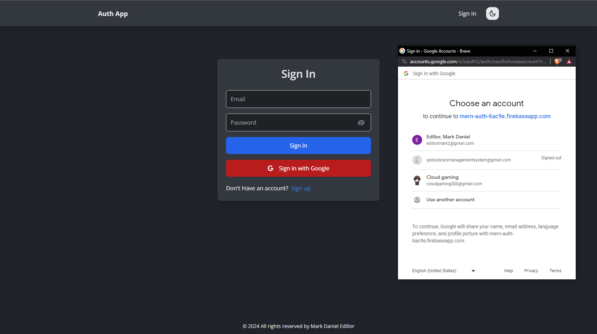
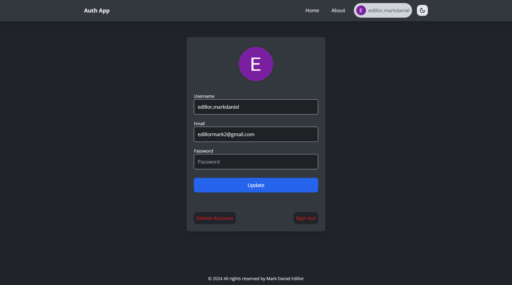

# Full-Stack MERN Auth Project

     
    

## Features

- User Authentication:
Easy sign-up, log-in, and log-out functionalities.
Seamless sign-in using Google account.
- User Profile: Update user data, Delete account, Sign out.
- Responsive UI: Crafted with React for a smooth and responsive user interface.
- Secure Data Handling: Node.js, Express, and MongoDB work together to ensure secure data handling.
- JSON Web Tokens (JWT): Implements JWT for enhanced user authentication security.
  
## Technologies Used
- Frontend: React with efficient client-side routing.
- Backend: Node.js and Express.
- Database: MongoDB, with MongoDB Atlas as the cloud-based solution.
- Authentication: JSON Web Tokens (JWT) for an extra layer of protection.
- Google Sign-In: Seamlessly sign in using Google account.
  
## Development Tools
- IDE: Visual Studio Code.
- Version Control: GitHub for efficient version control.
  
## Deployment
- Firebase: serves as the backend for user authentication and store images.
= Database: MongoDB Atlas for cloud-based database solutions.
- Hosting: Render provides a reliable and scalable environment for deploying the application.

## License
This project is all rights reserved by Mark Daniel Edillor.

## Contact
For any questions or feedback, feel free to contact me at edillormark2@gmail.com or my Facebook account, Mark Daniel Edillor.
